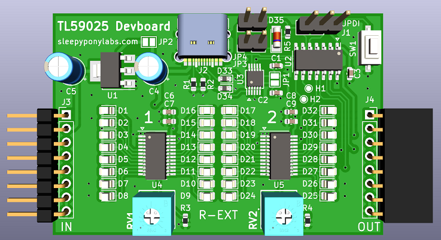
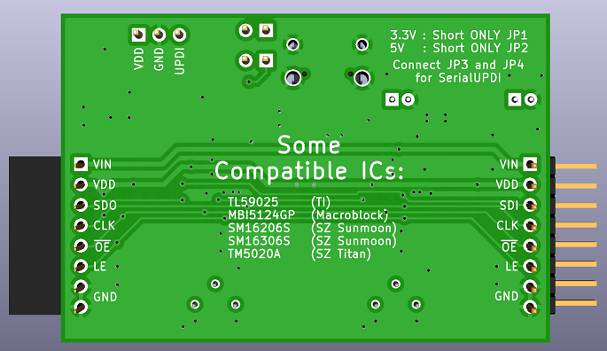

# TLC59025 Devboard

This is an open-source KiCAD design files for a development for [Texas Instruments TLC59025](https://www.ti.com/lit/ds/symlink/tlc59025.pdf) 16-Channel Constant Current LED Driver (and clones).

## Pictures

## Features

This devboard provides full flexibility for testing various configurations of the chip and surrounding circuits.

- Support original and clones in QSOP-24 package:
	- TI TLC59025IDBQR
	- Macroblock MBI5124GP
	- Shenzhen Sunmoon SM16206S
	- Shenzhen Sunmoon SM16306S
	- Shenzhen Titan TM5020A
- Full control over the chip's functions:
	- Output LEDs on all output channels.
	- R-EXT trimpot on each chip for adjusting the sink current.
	- All control pins break out.
- Cascade design
	- Input and output headers provided for cascading of modules (allows single controller only).
- Multiple power options
	- USB Type-C
	- Input header (both regulated and unregulated)
	- Optional footprint for an LDO.
- Onboard Microcontroller
	- Optional footprint for ATtiny214/414/814.
	- A user button and several debug pads provided.
	- A CH340 bridge for serial communication with a computer.
	- UPDI Header included.
	- SerialUPDI support included.
	
## Revisions

We are currently at Revision 1. Changelog is below:

**Revision 1 (September 2022)**
 - Initial Design

## What is provided

The goal of this repository is to enable you to build this on your own as easy as possible (although I originally plan to sell this as a kit as well). **The schematics, PCB design, and an interactive BOM is provided.**

This project is licensed under the [Solderpad Hardware License v2.1](http://solderpad.org/licenses/SHL-2.1/).

3D models that are use to render the board in KiCAD is not included. They are all from GrabCad and you could search and download them by yourself.

## Third-Party 3D Models

- 6x3.5mm Tactile Button by Gabriel Tóth: https://grabcad.com/library/6x3-5mm-smd-tactile-button-1
- Bourns 3362P Trimpot by Markus Walter: https://grabcad.com/library/bourns-3362p-1-102lf
- USB Type-C port by Hamza Huzair: https://grabcad.com/library/usb-type-c-port-smd-type-1
 
